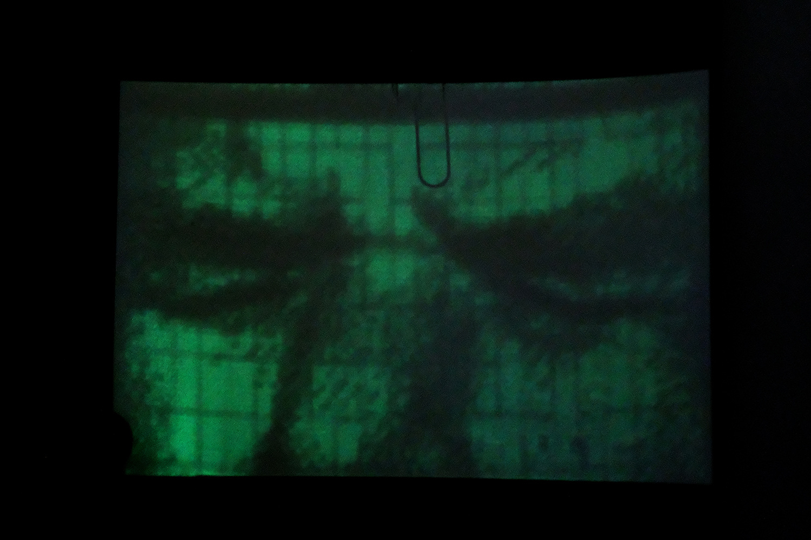
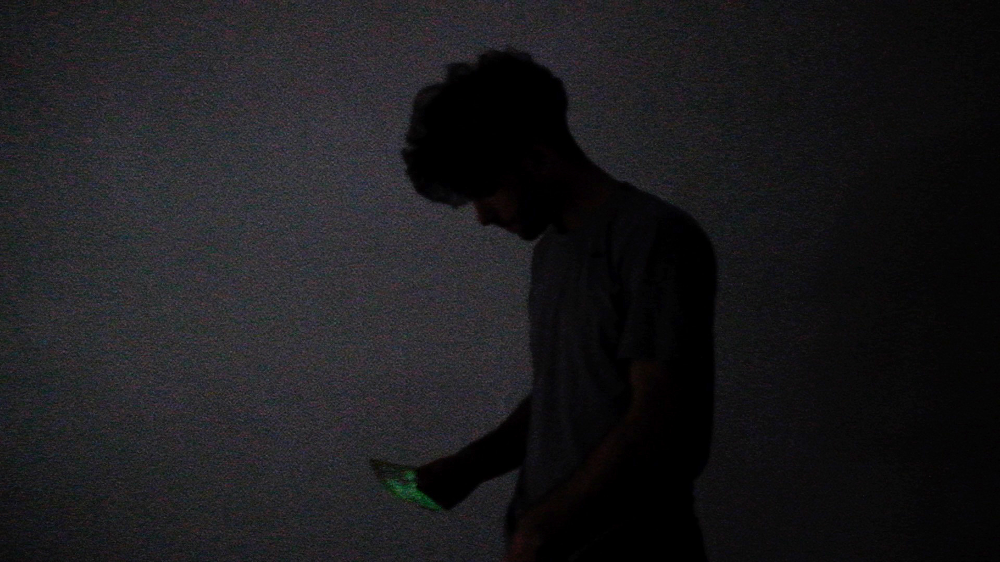

  **amnesia** - 2018

###### + expuesto en la muestra del primer concurso de arte y tecnología del fondo nacional de las artes en el centro cultural kirchner, buenos aires, argentina. 2019.
###### + expuesto en el festival audiovisual de bariloche 2018, bariloche, argentina
###### - - - - - - - - - - - - - - - - - - - - - - - - - - - - - - - - -
###### + shown in the first art and technology competition show, hosted by the national fund for the arts in the kirchner cultural center, buenos aires, argentina. 2019
###### + shown in the 2018 bariloche audiovisual festival, bariloche, argentina

\
experimento sobre la memoria y la muerte.
el proyecto explora la memoria colectiva y su carácter fuertemente efímero, los procesos mediante los cuales esta desaparece y el accionar colectivo requerido para mantenerla viva.

la pieza reflexiona sobre la importancia que cobra la memoria cuando es ejercitada de manera colectiva, como herramienta reparadora de procesos y eventos sociopolíticos traumáticos o destructivos, como catalizador de crecimiento, como símbolo de resistencia.

el eje central de esta instalación es la proyección de 80 retratos de personas muertas a manos del estado en los últimos 28 años (mi tiempo de vida). estos retratos son proyectados sobre tarjetas de papel fosforescentes, creando imágenes efímeras y fantasmagóricas. la instalación reacciona frente a la cantidad de personas que la visitan, modulando la intensidad y el tiempo de vida de los retratos en función de la presencia colectiva del público.

los espectadores pueden optar por llevarse una tarjeta, preservando el retrato que porta. al ser sensible a la luz, el mismo debe ser tratado con cuidado a fines de no desaparecer.

este esfuerzo, dada la naturaleza efímera de las imágenes, es en ultima instancia en vano. los retratos están condenados al olvido.

mención especial en el festival audiovisual de bariloche 2018

seleccionada para la muestra de arte y tecnología del fondo nacional de las artes, en el centro cultural kirchner, 2019

gracias a julieta, andrea, nahuel, bata y matías.

###### creado con processing y openFrameworks.

###### - - - - - - - - - - - - - - - - - - - - - - - - - - - - - - - - - - - - - - - - - - - - - - - - - - -

an experiment on memory and death
this project explores collective memory and its (sometimes) ephemeral form, the processes through which it disappears and the collective action required to keep it alive.

the piece reflects on the importance of memory when it is wielded collectively, as a tool for healing and repairing traumatic or destructive sociopolitical processes and events, as a catalyst for collective growth, as a symbol for resistance.

the central axis of this installation is a projection of 80 portraits of people who died at the hands of the state during the last 28 years (my lifetime). these portraits are projected onto phosphorescent paper cards, creating ephemeral and ghostly images. the installation reacts to the amount of visitors it receives, modulating the intensity and lifespan of the portraits in relation to the collective presence of the public.

spectators can opt to take a card with them, in an effort to preserve the portrait it carries. being sensitive to light, this portrait must be handled with great care in order to avoid its vanishment.

this effort, given the transitory nature of the portraits, is ultimately futile. the portraits are condemned to be forgotten.

special mention in the bariloche audiovisual festival 2018

selected for the arts and technology show of the national fund for the arts, in the kirchner cultural center, 2019

thanks to julieta, andrea, nahuel, bata and matías

###### made with processing and openFrameworks.

<iframe src="https://player.vimeo.com/video/310169031?color=ffffff&title=0&byline=0&portrait=0" width="670" height="377" frameborder="0" allow="autoplay; fullscreen; picture-in-picture" allowfullscreen></iframe>

