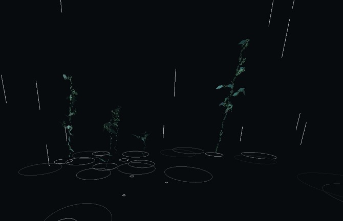
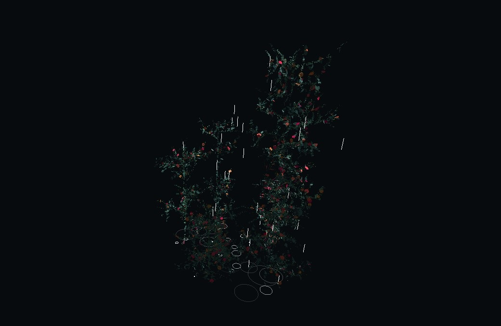

**bosque** - 2020

###### + expuesto en voltaje, salón de arte y tecnología, bogotá, colombia, 2020
###### - - - - - - - - - - - - - - - - - - - - - - - - - - - - - - - - -
###### + shown in voltaje, arts and technology salon, bogotá, colombia, 2020

\
co-creado con [greg sadetsky](https://greg.technology/){:target="_blank"}.

bosque es una pieza de animación generativa acerca de la esperanza y el deseo en tiempos difíciles. presenta una simulación de un sector de bosque que crece mecido por el viento.

la obra puede verse en vivo [acá](https://gregsadetsky.github.io/auzal-3d-forrest/){:target="_blank"}.

los troncos y ramas de los árboles están compuestos de oraciones de esperanza en relación a la situación creada por la pandemia y la subsiguiente crisis social y económica que enfrentan los pueblos de nuestros países latinoamericanos. estas oraciones provienen de un grupo diverso de personas y responden a necesidades y deseos de orden personal o colectivo. así, cada arbusto y árbol se encuentra conformado por anhelos y esperanzas que crecen y cobran volúmen conforme avanza la animación.

los árboles de este bosque digital se mecen en el viento. este viento es en realidad una reproducción del viento del oeste del noroeste patagónico (mi región natal y que habito actualmente). es importante mencionar que dicho viento del oeste no sólo es el predominante de la región, sino que además es el que trae las lluvias (cruzando la cordillera desde la costa pacífica chilena) que posibilitan el crecimiento de la vegetación y el desarrollo de nuestros ecosistemas de montaña.

este proyecto está anclado en la necesidad que siento de abrigar esperanzas en función de la situación sanitaria y social que se nos presenta. la decisión formal de representar este proceso con un bosque que crece lentamente se debe a la experiencia personal de haber presenciado durante mi infancia el quemarse y destruirse de los bosques de mi región local, y de haber tenido la oportunidad de ver su regeneración y nuevo crecimiento a lo largo de los años. esta pieza al mismo tiempo representa una desviación de los temas habituales de mi trabajo, en función de la necesidad vital de adoptar una óptica de esperanza y deseo de prosperidad frente los acontecimientos presentes.

seleccionado y exhibido en [voltaje](http://voltaje.co/){:target="_blank"}, salón de arte y tecnología de la ciudad de bogotá, colombia en octubre de 2020.

###### creado con p5.js y three.js

###### - - - - - - - - - - - - - - - - - - - - - - - - - - - - - - - - - - - - - - - - - - - - - - - - - - -

co-created with [greg sadetsky](https://greg.technology/){:target="_blank"}.

bosque is a generative animation piece about hope and desire in difficult times. it presents a simulation of an area of forest that grows swayed by the wind.

the piece can be seen live [here](https://gregsadetsky.github.io/auzal-3d-forrest/){:target="_blank"}.

the trunks and branches of each tree are comprised of sentences of hope and desire in relation to the global pandemic and it's subsequent social and economical crisis that our latinamerican countries face. these sentences come from a diverse group of people and respond to needs and wishes that are both individual and collective. thus, each shrub and tree is made of wishes and hope that grow as the animation advances. 

the trees of this digital forest are swayed by the wind. this wind is a reproduction from data of the western wind of the patagonian northwest (my birthplace and current area of residence). it's important to mention that this western wind is not only the predominant wind in the region, it is also what brings our rain (crossing the andes from the chilean pacific coast), which makes plant growth possible as well as the development of our mountain ecosystems. 

this project is anchored in the need to hold hopes in the face of our current situation. 

selected and exhibited in [voltaje](http://voltaje.co/){:target="_blank"}, arts and technology salon, bogotá, colombia, in october of 2020.

###### made with p5.js and three.js

