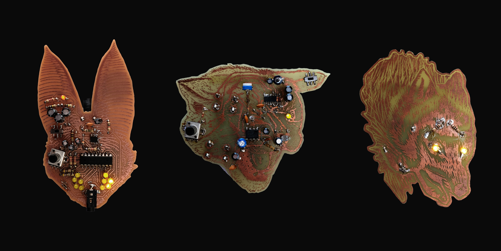
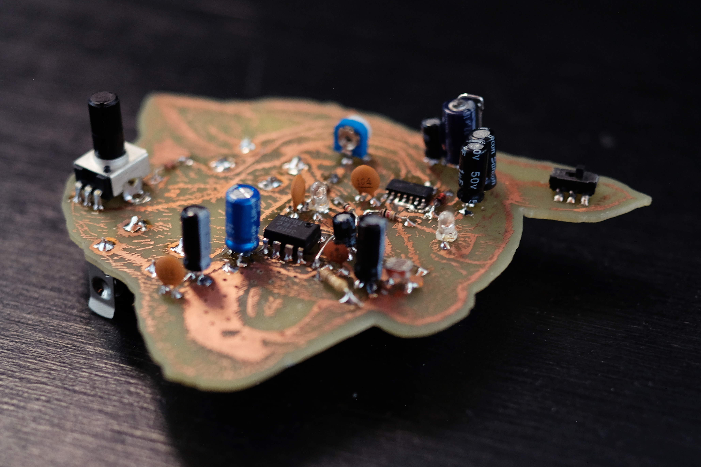
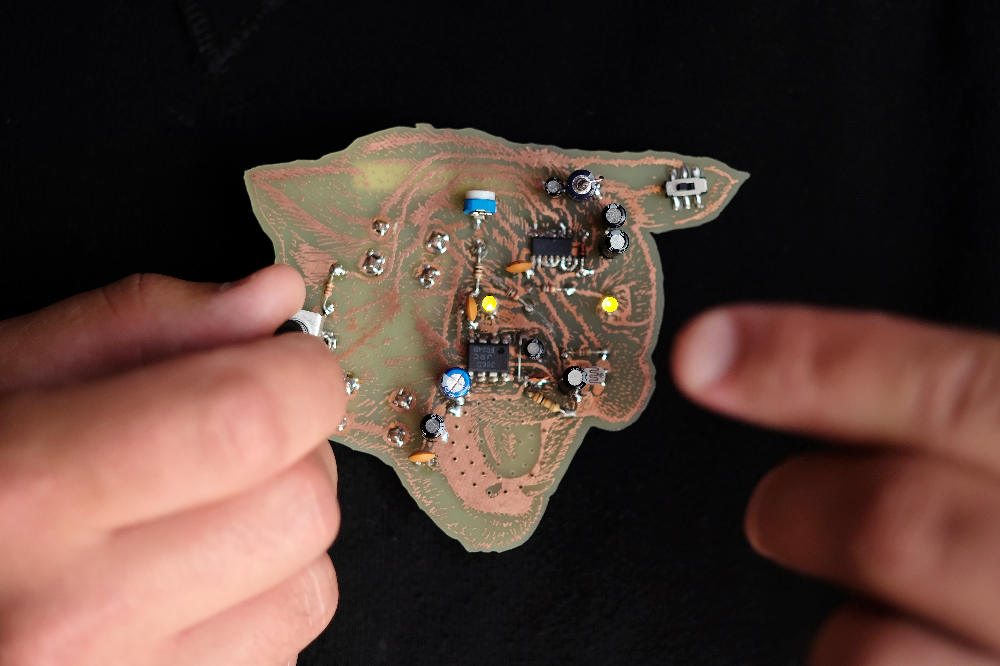
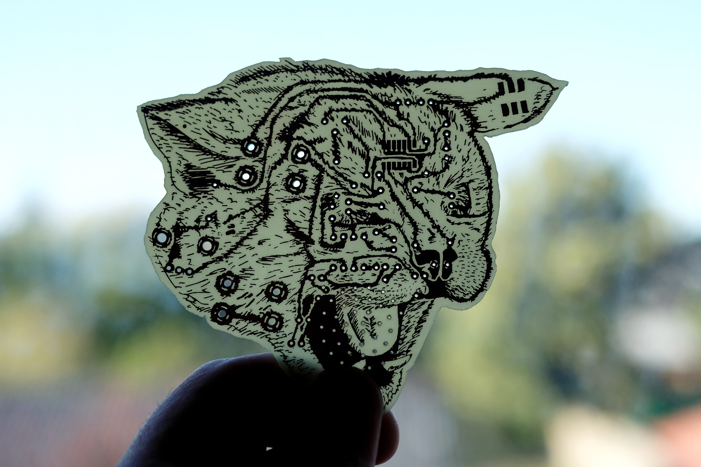
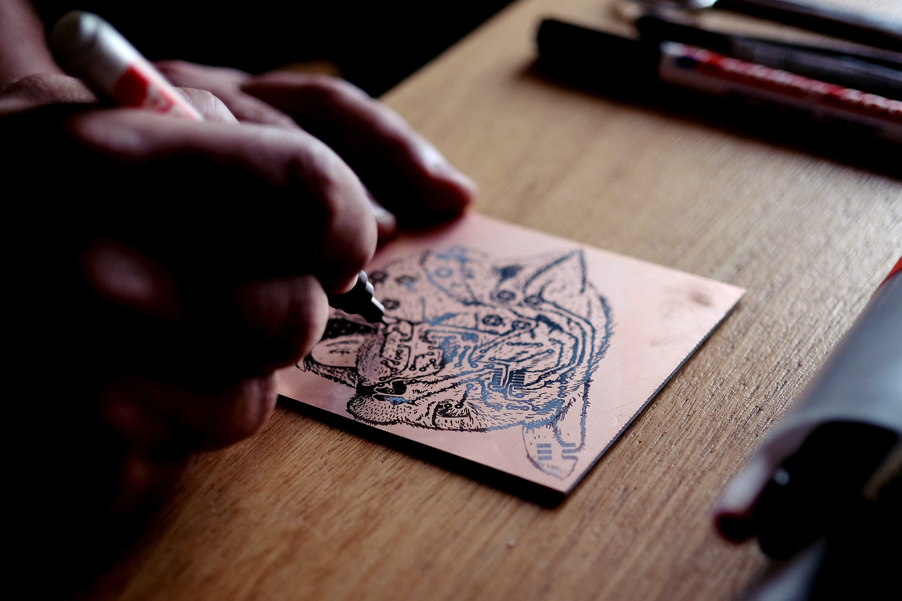

**familia 29** - 2020

###### + seleccionado para el premio jóvenes grabadores 2020
###### - - - - - - - - - - - - - - - - - - - - - - - - - - - - - - - - -
###### + finalist in the 202o edition of the young engravers prize

\
familia 29 es una serie de tres objetos que son a la vez piezas gráficas y circuitos electrónicos.

una búsqueda de alterar las forma tradicionales de producir circuitos impresos, introduciendo técnicas de las artes gráficas en este proceso. de esta forma, las "pistas" o segmentos conductivos de cobre son tratados como líneas gestuales, más allá de su función utilitaria de conectar puntos de un circuito. el cobre (que habitualmente queda del lado posterior del circuito) se encuentra en el anverso de cada placa, cumpliendo un rol protagónico junto con los componentes electrónicos. cada placa (que es al mismo tiempo dibujo y circuito), es desarrollada con técnicas vinculadas al grabado, como la xilografía en línoleo y la transferencia de toner por calor.

cada pieza de la serie se vincula estrechamente con las otras. el lobo emite luz, el gato produce sonidos oscilantes modulados por cuánta luz hay en su ambiente, y la polilla detecta campos electromagnéticos y los convierte en sonido y luz, lo que le permite "escuchar" directamente a los otros circuitos. de esta forma, estos objetos no sólo se asemejan en su morfología, sino que configuran un sistema de relaciones comunitarias.

seleccionado para el premio [jóvenes grabadores 2020](http://jovenesgrabadores.com.ar/edicion-4/){:target="_blank"}

###### - - - - - - - - - - - - - - - - - - - - - - - - - - - - - - - - - - - - - - - - - - - - - - - - - - -

family 29 is a series of three objects that are simultaneously graphic pieces and functioning electronic circuits. 

###### made with processing, arduino and openframeworks.

<iframe src="https://player.vimeo.com/video/473001188?color=ffffff&title=0&byline=0&portrait=0" width="670" height="400" frameborder="0" allow="autoplay; fullscreen; picture-in-picture" allowfullscreen></iframe>

<iframe src="https://player.vimeo.com/video/473002208?color=ffffff&title=0&byline=0&portrait=0" width="670" height="377" frameborder="0" allow="autoplay; fullscreen; picture-in-picture" allowfullscreen></iframe>

