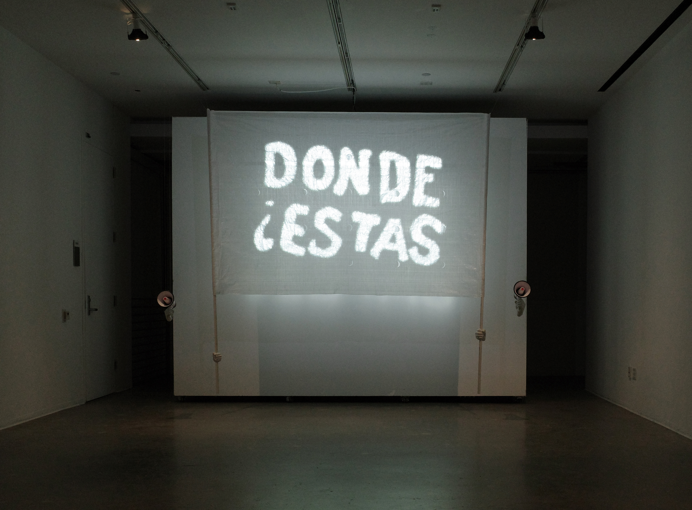
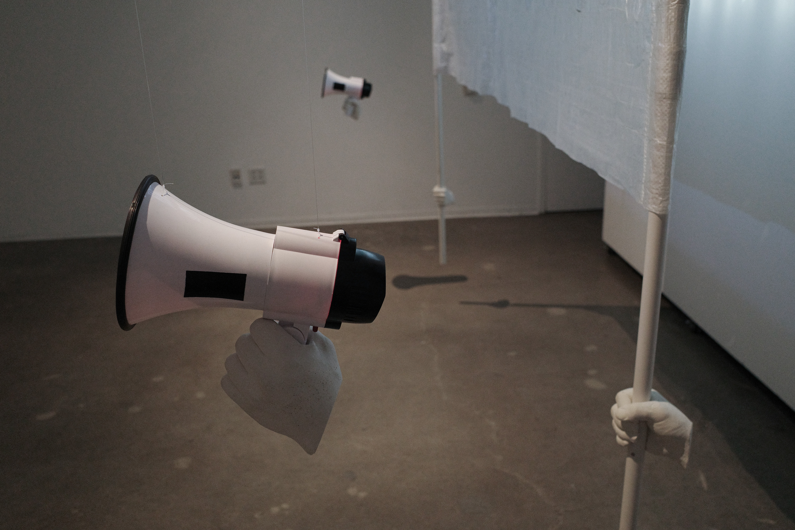
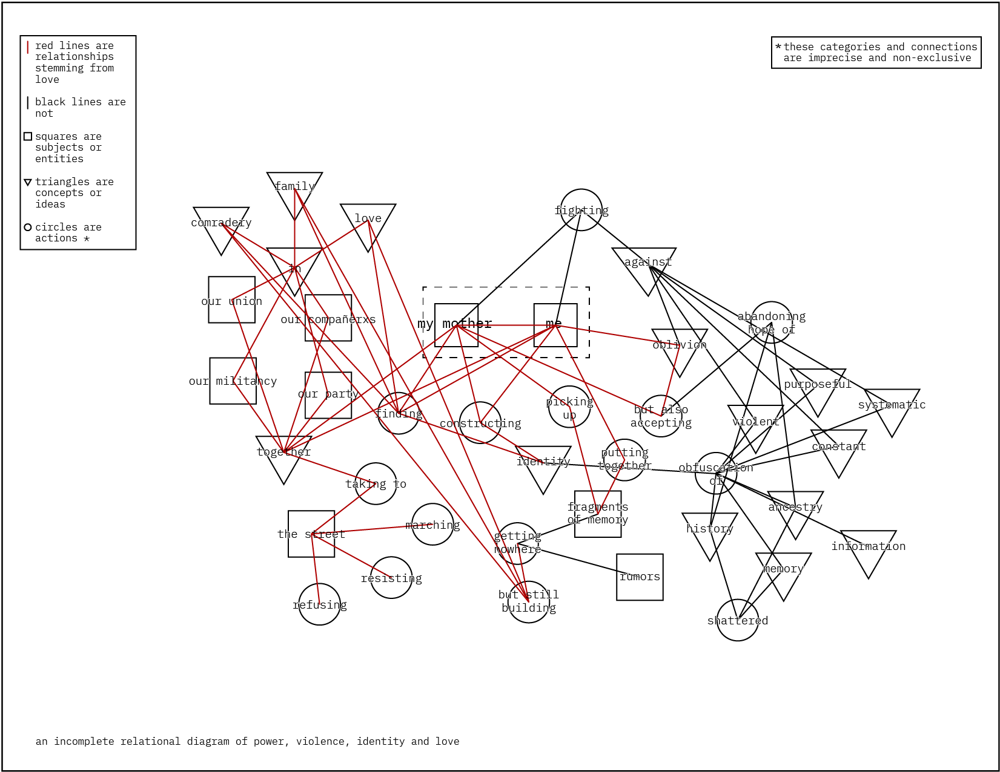

**manifestación** - 2022

###### + trabajo de primer año de la maestría en artes electrónicas de la universidad de california
###### - - - - - - - - - - - - - - - - - - - - - - - - - - - - - - - - -
###### + ucla media arts mfa first year work

\
trabajo del primer año de la [maestría en artes electrónicas](https://dma.ucla.edu/programs/mfa){:target="_blank"} de la universidad de california en los angeles (ucla).

una exploración personal de los procesos que formaron y continúan formando parte de mi identidad, del lugar que ocupa la memoria en mi vida y de las búsquedas que perduran gracias al amor. 

###### - - - - - - - - - - - - - - - - - - - - - - - - - - - - - - - - - - - - - - - - - - - - - - - - - - -

work from the first year of the ucla's [media arts mfa program](https://dma.ucla.edu/programs/mfa){:target="_blank"}.

a personal exploration of the processes that formed and continue to form my identity, of the place that memory occupies in my life and of the pursuits that continue thanks to love.

<iframe src="https://player.vimeo.com/video/745973534?color=ffffff&title=0&byline=0&portrait=0" width="670" height="377" frameborder="0" allow="autoplay; fullscreen; picture-in-picture" allowfullscreen></iframe>

