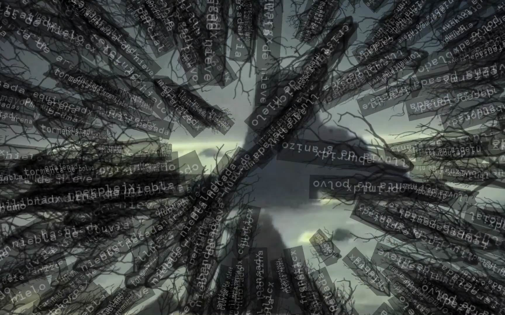
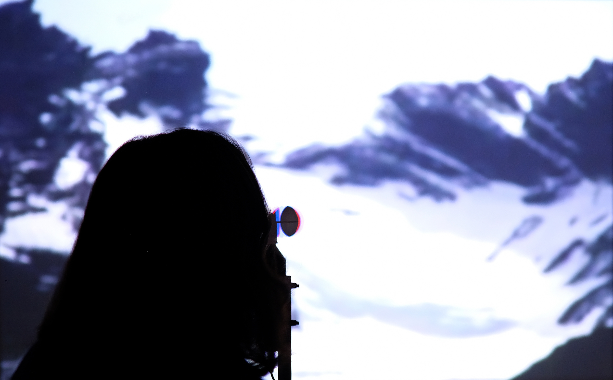

**parcialmente nublado** - 2019

###### + expuesto en mecha, muestra de arte colaborativo. bariloche, brgentina, 2019
###### - - - - - - - - - - - - - - - - - - - - - - - - - - - - - - - - -
###### + shown in mecha, collaborative art show. bariloche, argentina, 2019

\
pequeña instalación interactiva, desarrollada para [mecha](https://www.facebook.com/ProyectoMecha/){:target="_blank"}, un juego similar al cadáver exquisito, que culmina con una muestra de arte colaborativo.

está basada en un mural de [sato cereceda](https://www.instagram.com/satocereceda/){:target="_blank"}, y compuesta enteramente con material encontrado y de archivo: un anemómetro prestado, videos de 16 mm recuperados o robados, textos tomados de [repositorios](https://github.com/dariusk/corpora){:target="_blank"} online libres, sonidos grabados y descargados de internet.

la instalación explora temas de interferencia, ruido y obstáculos en un sentido general, junto al trabajo y esfuerzo requerido para sobrepasarlos.

###### creada con processing, arduino y openframeworks

###### - - - - - - - - - - - - - - - - - - - - - - - - - - - - - - - - - - - - - - - - - - - - - - - - - - -

small interactive installation, developed for [mecha](https://www.facebook.com/ProyectoMecha/){:target="_blank"}, a creative game similar to the exquisite corpse, which concludes in a collaborative art show.

the installation is based on a mural by [sato cereceda](https://www.instagram.com/satocereceda/){:target="_blank"}, and composed entirely of found and archived materials: a borrowed wind meter, reclaimed or stolen 16 mm videos, texts taken from free online [repositories](https://github.com/dariusk/corpora){:target="_blank"}, recorded and downloaded sounds.

the piece explores themes related to interference, noise and obstacles in a broad sense, together with the work and effort required to overcome them.

###### made with processing, arduino and openframeworks.

<iframe src="https://player.vimeo.com/video/380977405?color=ffffff&title=0&byline=0&portrait=0" width="670" height="377" frameborder="0" allow="autoplay; fullscreen; picture-in-picture" allowfullscreen></iframe>

