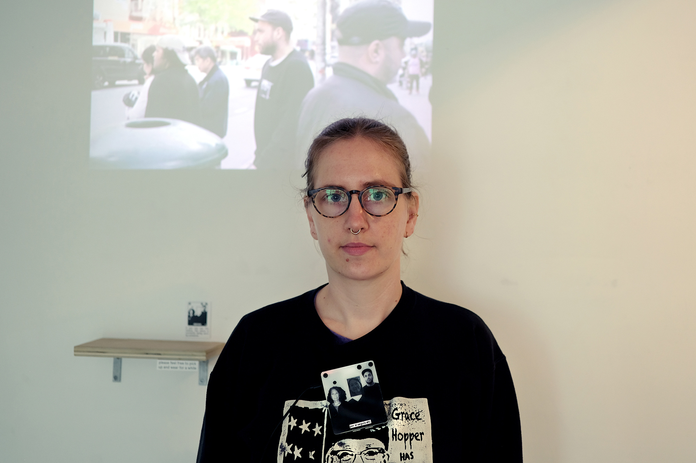
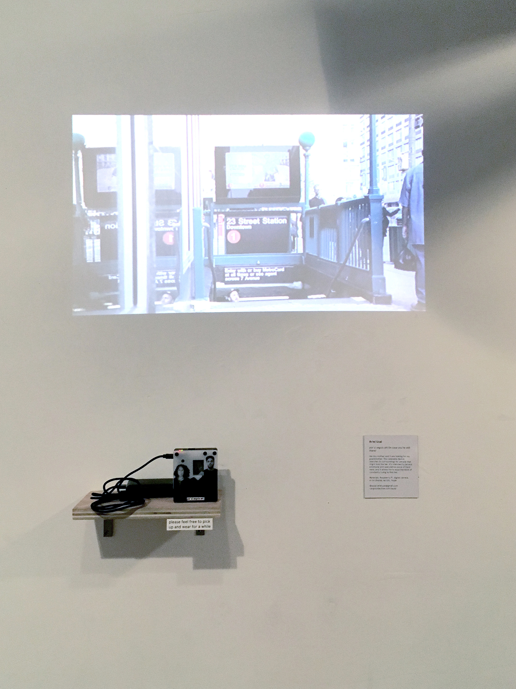
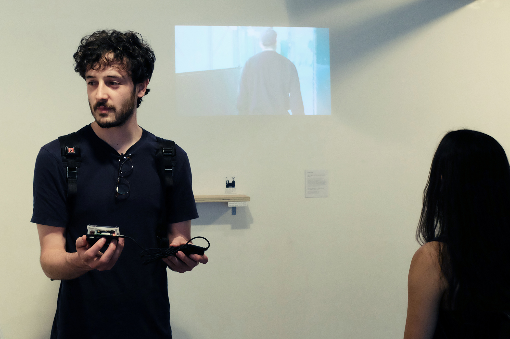
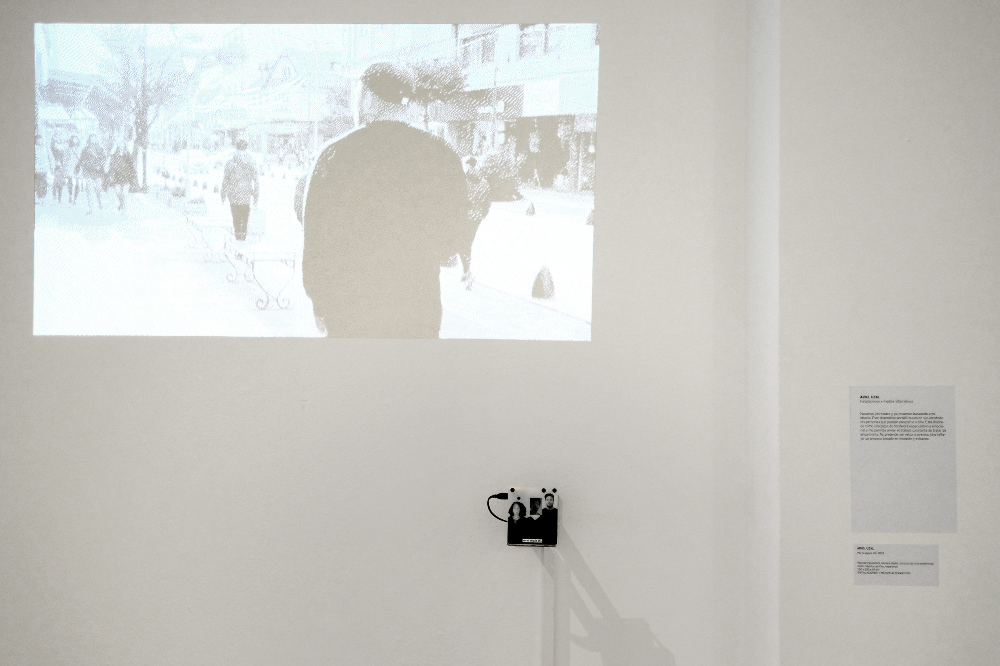
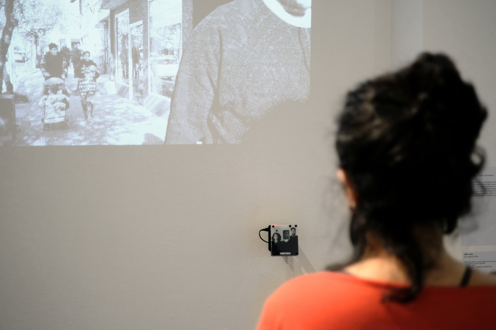
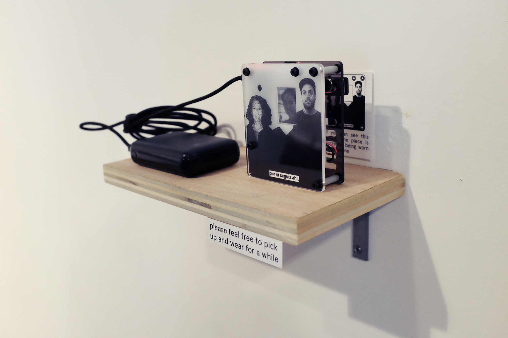

**por si seguís ahí** - 2019

###### + expuesto en la muestra final de la sesión de primavera 2019 la escuela de computación poética, nueva york, eeuu
###### + expuesto en el 108 salón nacional de artes visuales, casa nacional del bicentenario, buenos aires, argentina
###### - - - - - - - - - - - - - - - - - - - - - - - - - - - - - - - - -
###### + shown in the final showcase of the spring 2019 session of the school for poetic computation, new york, usa
###### + shown in the 108th national salon of visual arts, casa nacional del bicentenario, buenos aires, argentina

\
dispositivo portátil cuya función es encontrar a un miembro faltante de mi familia. está diseñado alrededor de un retrato familiar (de mi madre y mío) con un espacio vacío en el centro. el dispositivo está equipado con una pequeña cámara de video, que utiliza para explorar sus alrededores, buscando personas. cuando detecta una persona, recorta su rostro y lo coloca dentro del retrato. el rostro detectado es comparado con fotos de familiares conocidos, en un intento por establecer parentesco. el dispositivo crea un pulso de vibraciones constante (que el usuario siente contra su pecho) que simula el latido de un corazón. el puntaje de “parentesco” del rostro detectado modula este latido (cuantas más chances hayan de que esta persona sea un pariente nuestro, más rápido es el pulso).

este dispositivo intenta ser una pieza de hardware emocional y especulativo, permitiendo que quien lo usa alivie el trabajo constante de buscar a alguien que falta. no está diseñado para ser preciso o veloz, sino para reflejar un proceso que se basa en intuiciones y esfuerzo. a su vez, se presenta como lo contrario a un dispositivo de vigilancia: no almacena las imágenes que captura, no está conectado a ningún tipo de red, no se oculta ni presenta una apariencia amenazante.

el proyecto fue desarrollado durante la sesión de primavera 2019 de la [escuela de computación poética](https://sfpc.io/){:target="_blank"}. se desprende de trabajo y conversaciones con los alumnos y los docentes, y está cercanamente vinculado a mi trabajo para el fanzine grupal realizado en la clase de [teoría crítica](https://github.com/0ld-h3ad/DarkMatters-Spring2019){:target="_blank"}.

seleccionado y exhibido en el 108 salón nacional de artes visuales, organizado por la secretaría de cultura de la nación argentina, en la casa nacional del bicentenario. buenos aires, 2019.

gracias a todxs lxs alumnxs y docentes de la [sfpc](https://sfpc.io/classes/){:target="_blank"}, especialmente a  sheldon chang, [steffi schirmer](https://linse.me/about.html){:target="_blank"} y [greg sadetsky](https://greg.technology/){:target="_blank"}.

###### hecho con python y raspberry pi

###### - - - - - - - - - - - - - - - - - - - - - - - - - - - - - - - - - - - - - - - - - - - - - - - - - - -

this project is centered around a wearable device intended to find a missing family member. it’s designed around a family portrait (of my mother and me) with an empty space in the center. the device is equipped with a small video camera, which it uses to scan its surroundings, searching for people. once it finds a person, it isolates their face and displays it in the empty slot in the portrait. the found face is then cross referenced with photos of known family members, in an attempt to assert kinship. the device creates a constant vibrating pulse (which the user feels on their chest) that simulates a heartbeat. once the similarity of the found face is determined, this result is used to modulate the heartbeat (the higher the likelihood of a found person being a member of our family, the faster the heartbeat).

this device is intended to be a piece of emotional and speculative hardware, allowing the wearer to ease the work of constantly looking for someone. it is not designed for accuracy or speed, but rather to reflect a process that is based around intuitiveness and effort. it is intended to be the contrary of a surveillance device: it does not store the images it captures, it is not connected to any network, it is not hidden or threatening in its physical design.

the project was developed while attending the spring 2019 session of the [school for poetic computation](https://sfpc.io/){:target="_blank"} it stems from work and conversations with the students and teachers, and is closely related to my zine submission for the [critical theory class](https://github.com/0ld-h3ad/DarkMatters-Spring2019){:target="_blank"}.

selected for and shown in the 108th nacional visual arts salon, organized by the national secretary of culture, in the casa nacional del bicentenario. buenos aires, 2019

thanks to everyone (students and teachers) at [sfpc](https://sfpc.io/classes/){:target="_blank"}, specially sheldon chang, [steffi schirmer](https://linse.me/about.html){:target="_blank"} and [greg sadetsky](https://greg.technology/){:target="_blank"}.

###### made with python and raspberry pi

<iframe src="https://player.vimeo.com/video/339624987?color=ffffff&title=0&byline=0&portrait=0" border-radius="20px" width="670" height="377" frameborder="0" allow="autoplay; fullscreen; picture-in-picture" allowfullscreen></iframe>

<iframe src="https://player.vimeo.com/video/339602687?color=ffffff&title=0&byline=0&portrait=0" width="670" height="377" frameborder="0" allow="autoplay; fullscreen; picture-in-picture" allowfullscreen></iframe>

