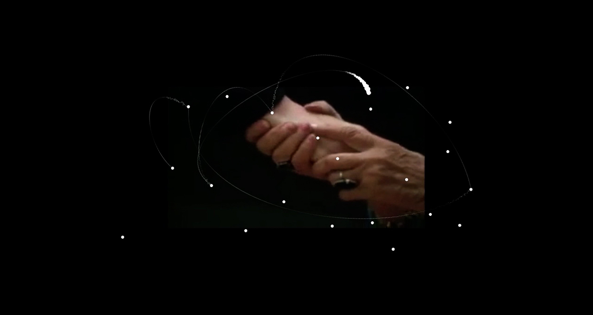
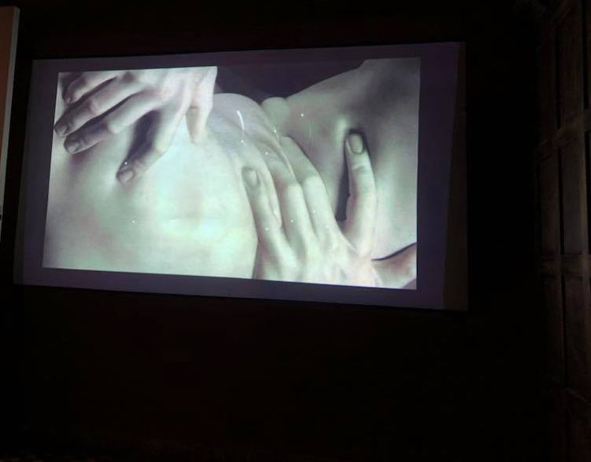

**principia, limbo gravitacional** - 2018

###### + expuesto en el festival internacional de video arte (fiva), categoría otramirada.ar, centro cultural san martín, buenos aires, argentina. 2018
###### + expuesto en la muestra colectiva trastienda, en el espacio de arte distrito 1, trelew, chubut, argentina. 2018
###### - - - - - - - - - - - - - - - - - - - - - - - - - - - - - - - - -
###### + shown in the international video arte festival (fiva), otramirada.ar category, san martín cultural center, buenos aires, argentina. 2018
###### + shown in the group show trastienda, in distrito 1 art space, trelew, chubut, argentina. 2018

\
pieza de net.art co-creada con [julieta caputo](https://cargocollective.com/julietacaputo){:target="_blank"} que indaga sobre el encierro psicológico y los patrones de repetición.

es una forma de interrogar nuestras conductas e identidades desde nuestra memoria: un pasado, siempre en presente, que configura nuestro porvenir. cada clip de video está anclado en recuerdos y sensaciones personales que configuran zonas gravitacionales de difícil (o imposible) escape. la pieza articula un recorrido laberíntico e inacabable no sólo a través de sus contenidos audiovisuales, que construyen una narrativa agobiante, sino también mediante su forma de enunciación: un funcionamiento en continua inercia que sumerge al espectador aún más en la lógica del sin salida, de la repetición perpetua.

las imágenes y sonidos que componen la obra, obtenidos en su totalidad de internet, emergen de diversas identidades individuales que nos convocan desde la vorágine audiovisual actual y nos inducen a indagar sobre nosotros mismos a través de un otro. la resignificación del material, a través de su apropiación e intervención, procura que quien especta también reflexione sobre su propia identidad creando de este modo diversas intersecciones identitarias desde un mismo corpus de imágenes.

principia, limbo gravitacional explora lo inevitable, los patrones reiterativos, la recaída constante, el paradójico movimiento hacia el nuevo fracaso.

proyectada en:
\
\+ muestra colectiva trastienda en el espacio de arte distrito 1 de la ciudad de trelew, argentina
\
\+ festival internacional de video arte, categoría otramirada.ar, en el centro cultural san martín, argentina

###### creado con p5.js

###### - - - - - - - - - - - - - - - - - - - - - - - - - - - - - - - - - - - - - - - - - - - - - - - - - - -

audiovisual net.art piece co-created with [julieta caputo](https://cargocollective.com/julietacaputo){:target="_blank"}, which combines experimental video practices with computer programming of web technologies. it deals with the topics of psychological confinement and repetition patterns.

it is a way for us to interrogate our conducts and identities from the standpoint of our memory: a past, always present, that configures our future. each video clip is based on personal memories and sensations that create gravitational zones of extremely difficult (or impossible) escape. the experience weaves a labyrinthic and endless trail not only through its audiovisual contents, that build an oppressive narrative, but also in its discursive form: a motion of continual inertia that submerges the spectator even more so in the feeling of no escape, of perpetual repetition.

the images and sounds that comprise the piece, obtained completely from the internet, emerge from various individual identities that summon us from the current chaos of audiovisual production, and induce us to question our own selves from another’s point of view. the resignification of the material, through its appropriation and intervention, attempts to achieve that the spectator also reflects upon his or her own identity, creating various intersections of identities from a same corpus of images.

principia, gravitational limbo explores the inevitable, the reiterative patterns, the constant relapse, the paradoxical movement towards a new failure.

exhibitions:
- group show trastienda in distrito 1 art space, in the city of trelew, argentina
- festival internacional de video arte (international videoart festival), otramirada.ar catergory, in the san martín cultural center, argentina

###### made with p5.js

<iframe src="https://player.vimeo.com/video/259256934?color=ffffff&title=0&byline=0&portrait=0" width="670" height="419" frameborder="0" allow="autoplay; fullscreen; picture-in-picture" allowfullscreen></iframe>

