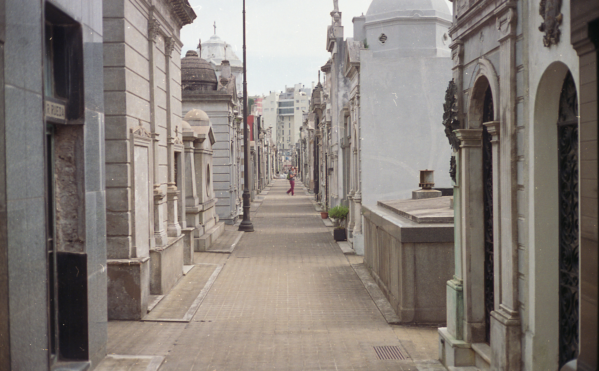

**que en paz descanse** - 2017

###### + expuesto en el open studio de la primer residencia del encuentro fase (arte, ciencia y tecnología), centro cultural recoleta, buenos aires, argentina. 2017.
###### - - - - - - - - - - - - - - - - - - - - - - - - - - - - - - - - -
###### + shown in the open studio for the first artist residency of the fase gathering (art, science and technology), recoleta cultural center, buenos aires, argentina. 2017

\
boceto de obra, creado como parte de la residencia fase 9, en el centro cultural recoleta.

una cámara colocada exactamente encima de una de las cámaras de seguridad del cementerio de la recoleta capta una imagen de un pasillo cada 10 segundos.

estas imágenes son estampadas con la fecha, la hora y un epitafio encontrado en el cementerio, para luego ser impresas de manera continua en una tira de papel térmico.

este boceto es una pequeña reflexión sobre algunas preguntas anotadas en un paseo por el cementerio: cual es la necesidad de vigilar cadáveres? acaso no atenta contra su descanso? qué tipo de cosa esperaríamos ver al espiar muertos? o es que los controlamos para que permanezcan muertos? que han hecho en vida los enterrados en la recoleta para necesitar sentirse seguros? que temen los muertos? hay alguien que observa las cantidades copiosas de material producido por estas cámaras?

###### creado con processing y openFrameworks.

###### - - - - - - - - - - - - - - - - - - - - - - - - - - - - - - - - - - - - - - - - - - - - - - - - - - -

small sketch, created as part of the fase 9 art residency, in the centro cultural recoleta, buenos aires.

a camera positioned exactly above one of the security cameras in the famous recoleta cemetery captures an image of an internal lane every 10 seconds.

these images are stamped with the date, time and an epitaph found in the cemetery, to be printed continuously in a roll of thermal paper.

this sketch is a brief reflection on some questions written down whilst walking around the cemetery: what is the need in keeping watch over corpses? does this not interfere with their rest? what do we expect to see when spying on the dead? or are we controlling them to ensure they stay dead? what did the people buried in recoleta do in life to need to feel safe once dead? what are the dead afraid of? does anybody watch the copious amounts of footage produced by these cameras?

###### made with processing and openFrameworks.

