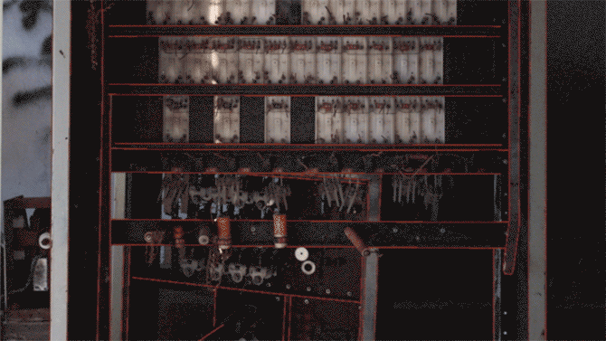

**un derrumbe posible** - 2018

###### + expuesto en la 12° edición del festival de videoarte proyector, en el centro cultural conde duque, españa, madrid. 2019.
###### - - - - - - - - - - - - - - - - - - - - - - - - - - - - - - - - -
###### + shown in as part of the 12°edition of the proyector video art festival, in the conde duque cultural center, madrid, spain. 2019

\
co-creado con [julieta caputo](https://cargocollective.com/julietacaputo){:target="_blank"}.

un derrumbe posible es una videoinstalación que presenta un espacio configurado por cuatro proyecciones de video. cada canal consta de una fotografía intervenida mediante animaciones; éstas simulan la deconstrucción estructural de los objetos fotografiados. la forma visual y la cadencia de las animaciones está vinculada a una sucesión de eventos sonoros. cada sonido es una grabación directa de un suspiro de los artistas.

la pieza explora la posibilidad de la caída, construye un espacio donde vincularse con el desarme, la pérdida del exoesqueleto y la tregua. es una representación visual y espacial que nace del encuentro, de la chance improbable de soltarse en y sobre otro.

de esta forma, la instalación configura un refugio, un asilo, un derrumbe posible.

esta pieza surgió de nuestro trabajo durante la residencia manta, en san martín de los andes, en 2018.

un derrumbe posible montado en el centro cultural conde duque, madrid

###### creado con processing

###### - - - - - - - - - - - - - - - - - - - - - - - - - - - - - - - - - - - - - - - - - - - - - - - - - - -

co-created with [julieta caputo](https://cargocollective.com/julietacaputo){:target="_blank"}.

un derrumbe posible is a video installation that presents a physical space configured by four video projections. each video channel shows a photograph with overlaid animations that simulate the structural deconstruction of the represented objects. the visual form and rhythm of the animations is directly correlated with a series of sound events. each sound is a direct recording of one of the artists sighing.

this piece explores the possibility of the fall, it constructs a space in which one can relate with a process of disassembly, with the loss of an exoskeleton, with the truce. it’s a visual and spatial representation that is born from coming together, from the improbable chance of letting go in and onto someone else.

in this way, the installation constitutes a shelter, an asylum, a possible collapse.

this piece emerged from our work during the manta residency, in san martín de los andes, in 2018.

###### made with processing

<iframe src="https://player.vimeo.com/video/308848586?color=ffffff&title=0&byline=0&portrait=0" width="670" height="377" frameborder="0" allow="autoplay; fullscreen; picture-in-picture" allowfullscreen></iframe>

