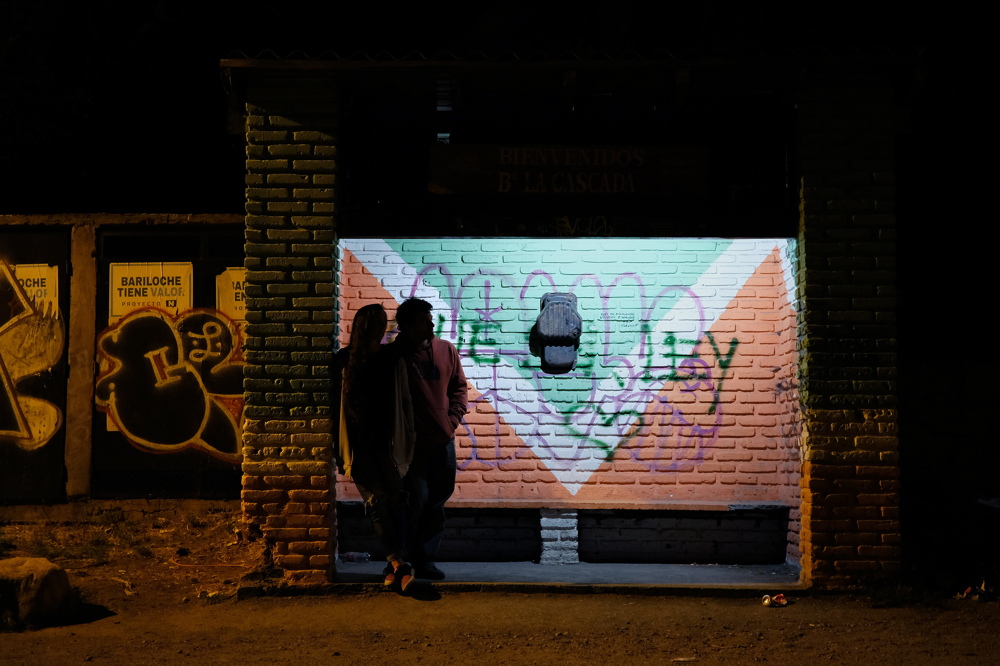

**vox populi** - 2019

intervención en espacio público, co-creada con [manuel rapoport](https://designopatagonia.com.ar/nosotros/){:target="_blank"}. un objeto sin tiempo, olvidado, que transmite relatos para quienes esperan en una parada de colectivos.

esta es la primer versión de de una serie de objetos similares. el dispositivo no tiene instrucciones ni información de ningún tipo, tan solo un pulsador. al ser oprimido, comienza a sonar un relato narrado, elegido al azar de una colección ecléctica. la voz del relator acompaña a quien espera, resignificando el tiempo muerto transcurrido en la parada.

###### hecho con arduino.

###### - - - - - - - - - - - - - - - - - - - - - - - - - - - - - - - - - - - - - - - - - - - - - - - - - - -

public space intervention, co-created with [manuel rapoport](https://designopatagonia.com.ar/nosotros/){:target="_blank"}. a timeless, forgotten object that transmits stories for those waiting in a public bus stop.

this is the first version of a series of similar objects. the device has no instructions or information of any sort, just a pushbutton. when pressed, a tale or poem begins to play, chosen at random from an eclectic collection. the voice of the narrator is a companion to the people waiting for transport, altering the meaning and nature of the dead time at the bus stop.

###### made with arduino.

<iframe src="https://player.vimeo.com/video/345768543?color=ffffff&title=0&byline=0&portrait=0" width="670" height="377" frameborder="0" allow="autoplay; fullscreen; picture-in-picture" allowfullscreen></iframe>

